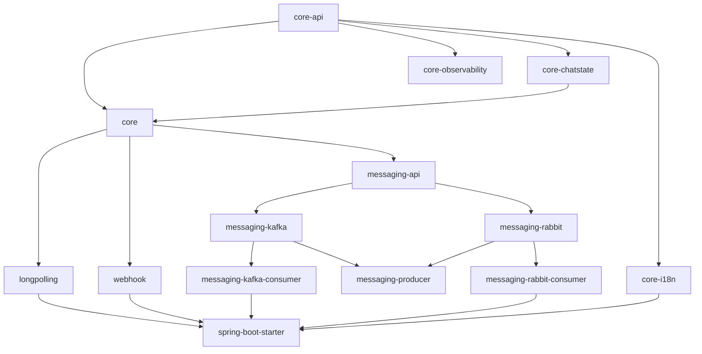

# easygram

[](https://central.sonatype.com/artifact/uz.osoncode.easygram/spring-boot-starter)
[](https://adoptium.net/)
[](https://spring.io/projects/spring-boot)
[](https://opensource.org/licenses/MIT)

> A Spring Boot framework for building Telegram bots with annotation-driven routing, pluggable transports (long-polling, webhook, Kafka, RabbitMQ), and zero boilerplate.

---

## Table of Contents

- [Features](#-features)
- [Module Structure](#-module-structure)
- [Requirements](#-requirements)
- [Installation](#-installation)
- [Transport Selection](#-transport-selection)
- [Quick Start](#-quick-start)
- [Internationalisation (i18n)](#internationalisation-i18n)
- [Module Documentation](#-module-documentation)
- [Building from Source](#-building-from-source)
- [Contributing](#-contributing)
- [License](#-license)

---

## ✨ Features

- **Zero-config autoconfiguration** — a single property is all that's required to start
- **Four transports** — long-polling (default), webhook, Kafka consumer, RabbitMQ consumer; switch with one property
- **Annotation-driven routing** — `@BotCommand`, `@BotText`, `@BotCallbackQuery`, `@BotContact`, `@BotLocation`, `@BotDefaultHandler`, and more
- **Smart parameter injection** — inject `Update`, `User`, `Chat`, `CallbackQuery`, `TelegramClient`, `BotRequest`, `BotResponse`, or annotated scalars
- **Composable filter pipeline** — `BotFilter` to intercept every update before handlers (auth, logging, rate-limiting, …)
- **Chat state management** — `@BotChatState` + pluggable `BotChatStateService`; ships with a thread-safe in-memory default; annotation-driven transitions via `@BotForwardChatState` / `@BotClearChatState`
- **Handler priority** — `@BotOrder` for fine-grained control when multiple handlers match
- **Exception handling** — `@BotExceptionHandler` per exception type inside `@BotController`
- **Multiple return types** — `BotApiMethod<?>`, `Collection<BotApiMethod<?>>`, `Collection<Object>` (mixed), `String`, `LocalizedReply`, or `void`
- **Broker publishing** — publish every update to Kafka or RabbitMQ via a single dependency
- **Internationalisation (i18n)** — `core-i18n` provides locale resolution, `BotMessageSource`, `BotKeyboardFactory`, `@BotReplyButton`, `LocalizedReply` return type, and `Locale` injection out-of-the-box
- **Fully overridable** — every bean uses `@ConditionalOnMissingBean`; swap anything without forking

---

## 🗂️ Module Structure

```
easygram/
│
├── core-api/                   # Pure contracts: interfaces, annotations, models
│                               # (BotFilter, BotHandler, BotRequest, BotResponse,
│                               #  all handler/arg annotations, BotConfigurer, …)
│
├── core-chatstate/             # Optional: InMemoryBotChatStateService
│                               # (replace with Redis/JDBC by providing your own @Bean)
│
├── core-i18n/                  # Optional: i18n support (BotMessageSource, keyboards, Locale injection)
│
├── core/                       # Engine: dispatching, filter chain, argument resolvers,
│                               # return-type handlers, Bot abstract class, autoconfiguration
│
├── longpolling/                # Long-polling transport autoconfiguration
├── webhook/                    # Webhook transport autoconfiguration (Spring MVC)
│
├── messaging/                  # SPI: BotUpdatePublisher interface + BotUpdatePublishingFilter
├── messaging-kafka/            # Kafka publisher (KafkaTemplate)
├── messaging-rabbit/           # RabbitMQ publisher (RabbitTemplate)
├── messaging-producer/         # Smart routing: publishes to kafka OR rabbit based on property
│
├── kafka-consumer/             # Kafka consumer transport (@KafkaListener → Bot)
├── rabbit-consumer/            # RabbitMQ consumer transport (@RabbitListener → Bot)
│
├── spring-boot-starter/        # One-stop dependency: pulls transports + core + core-i18n
└── samples/                    # Runnable example applications for each transport
```

### Dependency graph



---

## 📋 Requirements

| Requirement | Version |
|---|---|
| Java | 17 |
| Spring Boot | 3.5.x |
| Build tool | Maven or Gradle |

---

## 📦 Installation

Add the starter to your `pom.xml` — it includes all transports and the core engine:

### Maven

```xml
<dependency>
    <groupId>uz.osoncode.easygram</groupId>
    <artifactId>spring-boot-starter</artifactId>
    <version>0.0.1</version>
</dependency>
```

### Gradle (Kotlin DSL)

```kotlin
implementation("uz.osoncode.easygram:spring-boot-starter:0.0.1")
```

> For broker publisher/consumer dependencies, see the relevant [module READMEs](#-module-documentation).

---

## 🔀 Transport Selection

Set `telegram.bot.transport` (or env var `TELEGRAM_BOT_TRANSPORT`) to choose the update source:

| Value | Default | Description | Module README |
|---|---|---|---|
| `LONG_POLLING` | ✅ | Polls the Telegram `getUpdates` API | [longpolling/README.md](longpolling/README.md) |
| `WEBHOOK` | | Receives POSTs from Telegram at a configured URL | [webhook/README.md](webhook/README.md) |
| `KAFKA_CONSUMER` | | Consumes JSON updates from a Kafka topic | [messaging-kafka-consumer/README.md](messaging-kafka-consumer/README.md) |
| `RABBIT_CONSUMER` | | Consumes JSON updates from a RabbitMQ queue | [messaging-rabbit-consumer/README.md](messaging-rabbit-consumer/README.md) |

Only **one** transport is active at a time. See the linked module README for full configuration properties.

---

## 🚀 Quick Start

### 1. Add the dependency and configure

```xml
<dependency>
    <groupId>uz.osoncode.easygram</groupId>
    <artifactId>spring-boot-starter</artifactId>
    <version>0.0.1</version>
</dependency>
```

```yaml
telegram:
  bot:
    token: ${BOT_TOKEN}
    # transport: LONG_POLLING   # optional; LONG_POLLING is the default
```

### 2. Create your main class

```java
@SpringBootApplication
public class MyBotApplication {
    public static void main(String[] args) {
        SpringApplication.run(MyBotApplication.class, args);
    }
}
```

### 3. Create a handler

```java
@BotController
public class MyBotHandler {

    @BotCommand("/start")
    public String onStart(User user) {
        return "👋 Hello, " + user.getFirstName() + "!";
    }

    @BotDefaultHandler
    public String onDefault() {
        return "I didn't understand that.";
    }
}
```

> For the full handler reference — annotations, parameter injection, return types, filters, and exception handling — see [core/README.md](core/README.md).

---

## ⌨️ Declarative Keyboards & Markups

Decouple keyboard creation from handler logic using the markup registry.

1. **Define markups** in a `@BotConfiguration` class:
   ```java
   @BotConfiguration
   public class MyMarkups {
   
       @BotMarkup("main_menu")
       public ReplyKeyboard mainMenu() {
           return ReplyKeyboardMarkup.builder()
                   .keyboardRow(new KeyboardRow("My Profile"))
                   .build();
       }
   }
   ```

2. **Attach to handlers** with `@BotReplyMarkup`:
   ```java
   @BotCommand("/start")
   @BotReplyMarkup("main_menu")
   public String onStart() {
       return "Welcome!";
   }
   ```

3. **Or attach programmatically** using `PlainReply` / `LocalizedReply`:
   ```java
   @BotCommand("/start")
   public PlainReply onStart() {
       return PlainReply.of("Welcome!").withMarkup("main_menu");
   }
   ```

4. **Remove keyboard** with `@BotClearMarkup`:
   ```java
   @BotCommand("/cancel")
   @BotClearMarkup
   public String onCancel() {
       return "Cancelled.";
   }
   ```
   Or programmatically:
   ```java
   return PlainReply.of("Cancelled.").removeMarkup();
   ```

---

## 🌍 Internationalisation (i18n)

Add `core-i18n` (already included transitively by `spring-boot-starter`) to get:
- `BotMessageSource` (locale-aware messages)
- `BotKeyboardFactory` (localised keyboards)
- `Locale` parameter injection in handlers
- `@BotReplyButton` message-key matching across languages

Minimal configuration:

```yaml
spring:
  messages:
    basename: messages/bot
    encoding: UTF-8

telegram:
  bot:
    i18n:
      default-locale: en
```

See [core-i18n/README.md](core-i18n/README.md) for full usage.

---

## 📚 Module Documentation

| Module | Artifact ID | Documentation |
|---|---|---|
| Core API (contracts) | `core-api` | [core-api/README.md](core-api/README.md) |
| Core Engine | `core` | [core/README.md](core/README.md) |
| Long-Polling Transport | `longpolling` | [longpolling/README.md](longpolling/README.md) |
| Webhook Transport | `webhook` | [webhook/README.md](webhook/README.md) |
| Chat State | `core-chatstate` | [core-chatstate/README.md](core-chatstate/README.md) |
| Internationalisation | `core-i18n` | [core-i18n/README.md](core-i18n/README.md) |
| Observability | `core-observability` | [core-observability/README.md](core-observability/README.md) |
| Messaging SPI | `messaging-api` | [messaging-api/README.md](messaging-api/README.md) |
| Kafka Publisher | `messaging-kafka` | [messaging-kafka/README.md](messaging-kafka/README.md) |
| RabbitMQ Publisher | `messaging-rabbit` | [messaging-rabbit/README.md](messaging-rabbit/README.md) |
| Smart Producer (Kafka + RabbitMQ) | `messaging-producer` | [messaging-producer/README.md](messaging-producer/README.md) |
| Kafka Consumer Transport | `messaging-kafka-consumer` | [messaging-kafka-consumer/README.md](messaging-kafka-consumer/README.md) |
| RabbitMQ Consumer Transport | `messaging-rabbit-consumer` | [messaging-rabbit-consumer/README.md](messaging-rabbit-consumer/README.md) |
| Spring Boot Starter | `spring-boot-starter` | [spring-boot-starter/README.md](spring-boot-starter/README.md) |
| Samples (runnable apps) | — | [samples/README.md](samples/README.md) |

---

## 🏗️ Building from Source

```bash
git clone https://github.com/oson-code/easygram.git
cd easygram

# Install all library modules to local Maven repository
mvn clean install -DskipTests -Dgpg.skip=true -Dmaven.javadoc.skip=true

# Build runnable sample apps (optional)
cd samples
mvn package -DskipTests
```

See [samples/README.md](samples/README.md) for what each sample does and the config to run it.

---

## 🤝 Contributing

Contributions are welcome! Please [open an issue](https://github.com/oson-code/easygram/issues) or submit a merge request. Follow the existing code style, add tests for new behaviour, and describe your changes clearly.

---

## 📄 License

MIT License — Copyright © 2026 [OSONCODE](https://osoncode.uz)
