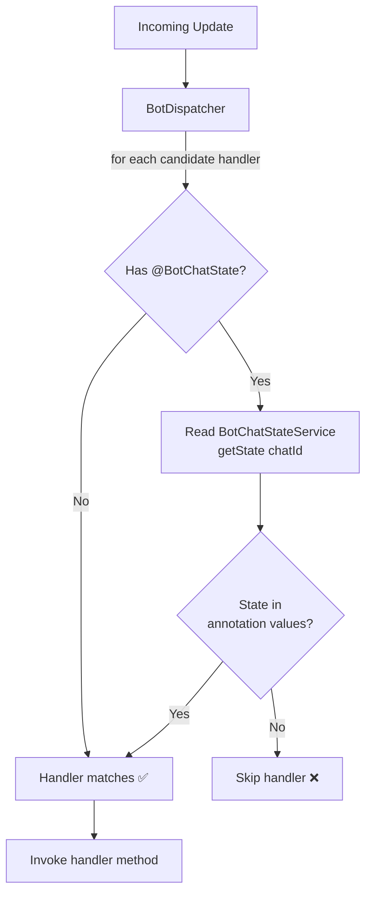
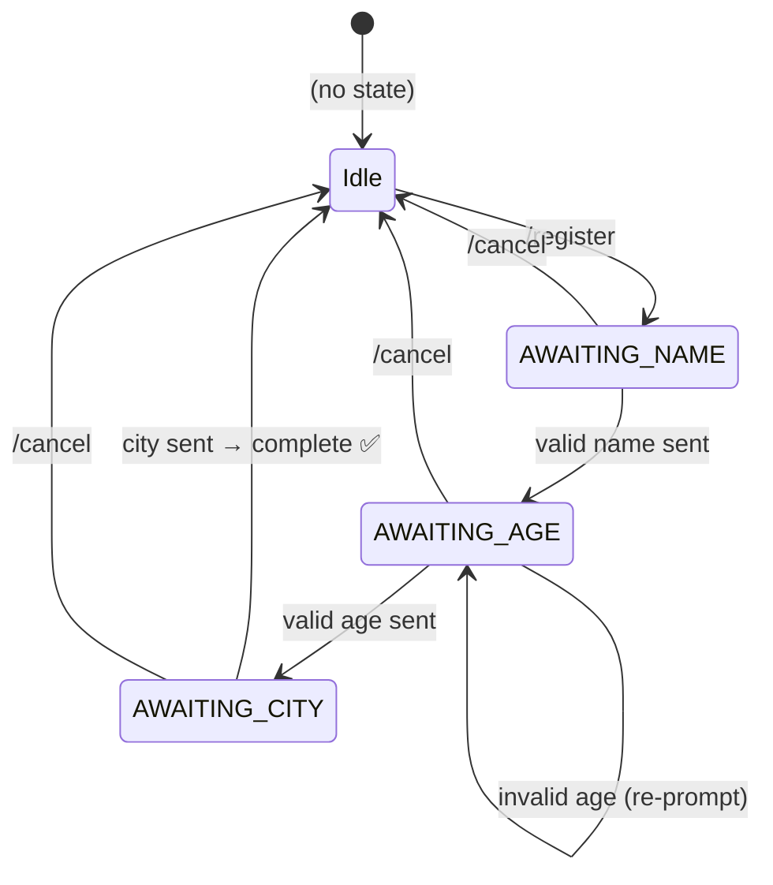

# core-chatstate

> Per-chat conversational state management for the Easygram framework.
> Ships with a thread-safe in-memory default and a clean interface for plugging in
> Redis, JDBC, or any other persistence layer.

---

## Table of Contents

- [Maven Dependency](#maven-dependency)
- [How It Works](#how-it-works)
- [BotChatStateService Interface](#botchatstateservice-interface)
- [@BotChatState Annotation](#botchatstate-annotation)
  - [Method-level](#method-level)
  - [Class-level (default for all handlers)](#class-level-default-for-all-handlers)
  - [Class-level with method-level override](#class-level-with-method-level-override)
- [Annotation-driven State Transitions](#annotation-driven-state-transitions)
  - [@BotForwardChatState](#botforwardchatstate)
  - [@BotClearChatState](#botclearchatstate)
- [Enum-based States (recommended)](#enum-based-states-recommended)
- [Multi-step Wizard Example](#multi-step-wizard-example)
- [Replacing the Default with a Persistent Backend](#replacing-the-default-with-a-persistent-backend)
  - [Redis](#redis)
  - [JDBC / JPA](#jdbc--jpa)
- [See Also](#see-also)

---

## Maven Dependency

```xml
<dependency>
    <groupId>uz.osoncode.easygram</groupId>
    <artifactId>core-chatstate</artifactId>
    <version>0.0.1</version>
</dependency>
```

> **Note:** `core-chatstate` is pulled in transitively by `longpolling`, `webhook`,
> `kafka-consumer`, `rabbit-consumer`, and `spring-boot-starter`. You only need this
> explicit dependency when building a custom transport module.

---

## How It Works

`InMemoryBotChatStateService` is registered automatically via `@ConditionalOnMissingBean`.
The framework's dispatcher checks `@BotChatState` metadata on each candidate handler
method against the current state before routing an incoming update.



---

## BotChatStateService Interface

```java
public interface BotChatStateService {

    /** Returns the current state string, or null if none is set. */
    String getState(Long chatId);

    /** Stores state; pass null to clear. */
    void setState(Long chatId, String state);

    // --- Enum-friendly overloads (default methods) ---

    /** Stores enum.name() as the state string. */
    default void setState(Long chatId, Enum<?> state);

    /** Returns the stored state parsed as an enum constant, or null. */
    default <T extends Enum<T>> T getStateAs(Long chatId, Class<T> type);
}
```

Inject `BotChatStateService` directly in any `@BotController` constructor or field:

```java
@BotController
public class MyController {

    private final BotChatStateService chatState;

    public MyController(BotChatStateService chatState) {
        this.chatState = chatState;
    }
}
```

---

## @BotChatState Annotation

`@BotChatState` restricts a handler to run only when the chat is in one of the listed states.

### Method-level

```java
@BotController
public class OrderFlow {

    @BotCommand("/order")
    public String startOrder(User user, BotChatStateService states) {
        states.setState(user.getId(), "AWAITING_PRODUCT");
        return "Which product would you like to order?";
    }

    @BotTextDefault
    @BotChatState("AWAITING_PRODUCT")
    public String collectProduct(@BotTextValue String product, User user,
                                 BotChatStateService states) {
        states.setState(user.getId(), "AWAITING_QUANTITY");
        return "How many units of \"" + product + "\"?";
    }

    @BotTextDefault
    @BotChatState("AWAITING_QUANTITY")
    public String collectQuantity(@BotTextValue String qty, User user,
                                  BotChatStateService states) {
        states.setState(user.getId(), (String) null); // clear state
        return "Order placed: " + qty + " unit(s). Thank you!";
    }
}
```

### Class-level (default for all handlers)

Apply `@BotChatState` to the **class** to set a default guard for every handler inside it.
All methods inherit the restriction without repeating the annotation:

```java
@BotController
@BotChatState("REGISTRATION")   // all handlers here require REGISTRATION state
public class RegistrationFlow {

    @BotTextDefault
    public String handleStep(@BotTextValue String text, ...) { ... }

    @BotContact
    public String handleContact(Contact contact, ...) { ... }
}
```

### Class-level with method-level override

A method can declare its own `@BotChatState` to **override** the class-level default.
An empty array (`@BotChatState` with no values) means "match any state" — useful for
an entry-point command that should be reachable regardless of where the user is:

```java
@BotController
@BotChatState({"AWAITING_NAME", "AWAITING_EMAIL"})   // default for all methods
public class ProfileWizard {

    @BotCommand("/profile")
    @BotChatState       // empty → override class default → accept any state
    public String startWizard(User user, BotChatStateService states) {
        states.setState(user.getId(), "AWAITING_NAME");
        return "What's your name?";
    }

    @BotTextDefault
    @BotChatState("AWAITING_NAME")
    public String collectName(@BotTextValue String name, ...) { ... }

    @BotTextDefault
    @BotChatState("AWAITING_EMAIL")
    public String collectEmail(@BotTextValue String email, ...) { ... }
}
```

---

## Annotation-driven State Transitions

Calling `BotChatStateService.setState(...)` in every handler is repetitive when the
transition is unconditional. The `@BotForwardChatState` and `@BotClearChatState`
annotations (from `core-api`) let the framework apply the transition **automatically
after a successful handler return**.

### @BotForwardChatState

```java
import uz.osoncode.easygram.core.chatstate.annotation.BotForwardChatState;

@BotCommand("/register")
@BotChatState            // reachable from any state
@BotForwardChatState("AWAITING_NAME")
public String startRegistration() {
    return "Step 1/3 — What is your full name?";
}

@BotTextDefault
@BotChatState("AWAITING_NAME")
@BotForwardChatState("AWAITING_AGE")
public String collectName(@BotTextValue String name) {
    return "✅ Name: " + name + "\nStep 2/3 — How old are you?";
}
```

The state is set to the annotation value **after** the method returns without error.
No `BotChatStateService` field is needed at all.

### @BotClearChatState

```java
import uz.osoncode.easygram.core.chatstate.annotation.BotClearChatState;

@BotTextDefault
@BotChatState("AWAITING_CITY")
@BotClearChatState
public String collectCity(@BotTextValue String city) {
    return "🎉 Registration complete! City: " + city;
    // state is automatically cleared after this method returns
}
```

### Precedence rules

- If **both** annotations are present on the same method, `@BotClearChatState` takes precedence.
- Both annotations are **silently ignored** if no `BotChatStateService` bean is present.

### When to keep manual service calls

Annotations apply **unconditionally** after the handler returns. If the transition
depends on runtime conditions (e.g. advance only when input is valid, stay in the same
state on validation failure), continue using `BotChatStateService` directly:

```java
@BotTextDefault
@BotChatState("AWAITING_AGE")
public String collectAge(@BotTextValue String ageText, User user,
                         BotChatStateService states) {
    try {
        int age = Integer.parseInt(ageText.trim());
        states.setState(user.getId(), "AWAITING_CITY");    // conditional advance
        return "✅ Age: " + age + "\nStep 3/3 — Which city do you live in?";
    } catch (NumberFormatException e) {
        return "⚠️ Please enter a valid number.";           // state unchanged
    }
}
```

---

## Enum-based States (recommended)

Using an `enum` instead of raw strings gives compile-time safety and IDE autocompletion.
`BotChatStateService` has built-in overloads for enums:

```java
public enum OrderState {
    AWAITING_PRODUCT,
    AWAITING_QUANTITY
}
```

```java
// Store an enum constant
states.setState(userId, OrderState.AWAITING_PRODUCT);

// Retrieve and parse back
OrderState current = states.getStateAs(userId, OrderState.class);

// Clear state
states.setState(userId, (String) null);
```

Use the enum's `.name()` string in `@BotChatState`:

```java
@BotTextDefault
@BotChatState("AWAITING_PRODUCT")   // matches OrderState.AWAITING_PRODUCT.name()
public String collectProduct(...) { ... }
```

---

## Multi-step Wizard Example

A three-step registration flow using **annotation-driven state transitions** — no
`BotChatStateService` injection needed except for the conditional `collectAge` step:



```java
public enum RegistrationState {
    AWAITING_NAME, AWAITING_AGE, AWAITING_CITY
}

@BotController
@BotChatState({"AWAITING_NAME", "AWAITING_AGE", "AWAITING_CITY"})
public class RegistrationFlowController {

    @BotCommand("/register")
    @BotChatState            // override class guard — reachable from any state
    @BotForwardChatState("AWAITING_NAME")
    public String startRegistration() {
        return "Step 1/3 — What is your full name?";
    }

    @BotTextDefault
    @BotChatState("AWAITING_NAME")
    @BotForwardChatState("AWAITING_AGE")
    public String collectName(@BotTextValue String name) {
        return "✅ Name: " + name + "\nStep 2/3 — How old are you?";
    }

    // Conditional transition — must use BotChatStateService directly
    @BotTextDefault
    @BotChatState("AWAITING_AGE")
    public String collectAge(@BotTextValue String ageText, User user,
                             BotChatStateService states) {
        try {
            int age = Integer.parseInt(ageText.trim());
            states.setState(user.getId(), RegistrationState.AWAITING_CITY);
            return "✅ Age: " + age + "\nStep 3/3 — Which city do you live in?";
        } catch (NumberFormatException e) {
            return "⚠️ Please enter a number.";
        }
    }

    @BotTextDefault
    @BotChatState("AWAITING_CITY")
    @BotClearChatState
    public String collectCity(@BotTextValue String city) {
        return "🎉 Registration complete! City: " + city;
    }
}

@BotController
public class GlobalCommandController {

    private final BotChatStateService chatState;

    public GlobalCommandController(BotChatStateService chatState) {
        this.chatState = chatState;
    }

    @BotCommand("/cancel")
    @BotClearChatState
    public String cancel(User user) {
        String state = chatState.getState(user.getId());
        return state == null
               ? "No active wizard."
               : "❌ Wizard cancelled. Use /register to start over.";
    }

    @BotCommand("/status")
    public String status(User user) {
        RegistrationState s = chatState.getStateAs(user.getId(), RegistrationState.class);
        return s == null ? "No active wizard." : "Current step: " + s;
    }
}
```

> A fully runnable version of this example is in [`samples/chatstate-bot`](../samples/chatstate-bot).

---

## Replacing the Default with a Persistent Backend

`InMemoryBotChatStateService` stores state in a `ConcurrentHashMap`. State is lost on
restart and is not shared across multiple instances. For production, provide your own
`BotChatStateService` bean — `@ConditionalOnMissingBean` ensures the default is skipped.

### Redis

```java
@Bean
public BotChatStateService redisChatStateService(StringRedisTemplate redis) {
    return new BotChatStateService() {

        private static final String KEY_PREFIX = "bot:state:";

        @Override
        public String getState(Long chatId) {
            return redis.opsForValue().get(KEY_PREFIX + chatId);
        }

        @Override
        public void setState(Long chatId, String state) {
            String key = KEY_PREFIX + chatId;
            if (state == null) {
                redis.delete(key);
            } else {
                redis.opsForValue().set(key, state);
            }
        }
    };
}
```

Add a TTL to automatically expire abandoned conversations:

```java
redis.opsForValue().set(key, state, Duration.ofHours(24));
```

### JDBC / JPA

```java
@Bean
public BotChatStateService jdbcChatStateService(JdbcTemplate jdbc) {
    // Assumes table: CREATE TABLE bot_chat_state (chat_id BIGINT PRIMARY KEY, state VARCHAR(255));
    return new BotChatStateService() {

        @Override
        public String getState(Long chatId) {
            return jdbc.queryForObject(
                "SELECT state FROM bot_chat_state WHERE chat_id = ?",
                String.class, chatId);
        }

        @Override
        public void setState(Long chatId, String state) {
            if (state == null) {
                jdbc.update("DELETE FROM bot_chat_state WHERE chat_id = ?", chatId);
            } else {
                jdbc.update("""
                    INSERT INTO bot_chat_state (chat_id, state)
                    VALUES (?, ?)
                    ON CONFLICT (chat_id) DO UPDATE SET state = EXCLUDED.state
                    """, chatId, state);
            }
        }
    };
}
```

---

## See Also

- [`samples/chatstate-bot`](../samples/chatstate-bot) — fully runnable registration wizard
- [core/README.md](../core/README.md) — handler annotations and processing pipeline
- [core-api/README.md](../core-api/README.md) — `@BotChatState` annotation reference
