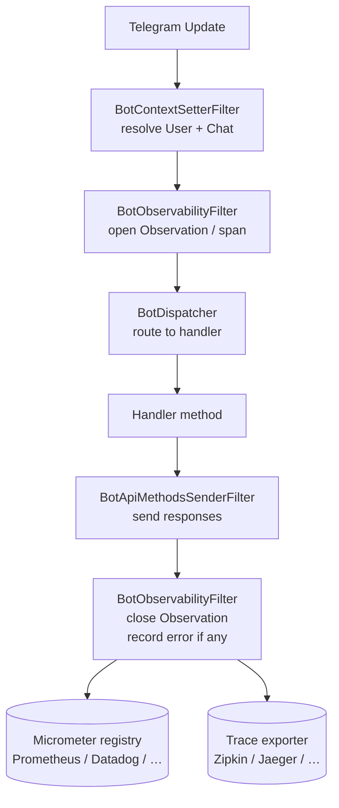

# core-observability

> Spring Boot Actuator and Micrometer integration for the Easygram framework.
> Adds health checks, info endpoint contributions, and automatic metrics + distributed
> tracing for every Telegram update processed.

---

## Table of Contents

- [Maven Dependency](#maven-dependency)
- [What It Provides](#what-it-provides)
- [Health Indicator](#health-indicator)
- [Info Contributor](#info-contributor)
- [Observability Filter (Metrics + Tracing)](#observability-filter-metrics--tracing)
- [Configuration](#configuration)
- [See Also](#see-also)

---

## Maven Dependency

```xml
<dependency>
    <groupId>uz.osoncode.easygram</groupId>
    <artifactId>core-observability</artifactId>
    <version>0.0.4</version>
</dependency>
```

> `core-observability` is **optional** — add it when you want Actuator or Micrometer
> integration. All beans are conditional and activate only when the relevant libraries
> are on the classpath.

---

## What It Provides

| Bean | Requires | Endpoint |
|---|---|---|
| `BotHealthIndicator` | `spring-boot-actuator` | `GET /actuator/health` |
| `BotInfoContributor` | `spring-boot-actuator` | `GET /actuator/info` |
| `BotObservabilityFilter` | `micrometer-observation` | Metrics + spans per update |

All three beans are guarded by `@ConditionalOnMissingBean` — declare your own to replace
any of them.

---

## Health Indicator

`BotHealthIndicator` reports `UP` after the bot has successfully called `GetMe` on the
Telegram API. It is exposed at `/actuator/health`.

**Example response:**

```json
{
  "status": "UP",
  "components": {
    "bot": {
      "status": "UP",
      "details": {
        "id": 123456789,
        "username": "mybot",
        "firstName": "My Bot",
        "transport": "LONG_POLLING"
      }
    }
  }
}
```

Reports `UNKNOWN` while the bot is still initialising (before `afterPropertiesSet()` completes).

---

## Info Contributor

`BotInfoContributor` adds a `telegram-bot` section to `/actuator/info`:

```json
{
  "telegram-bot": {
    "id": 123456789,
    "username": "mybot",
    "firstName": "My Bot",
    "transport": "LONG_POLLING"
  }
}
```

Nothing is contributed until bot metadata is available.

---

## Observability Filter (Metrics + Tracing)

`BotObservabilityFilter` wraps every incoming update in a Micrometer `Observation`. It
runs at order `BotFilterOrder.OBSERVATION` — just after `BotContextSetterFilter` so that
`User` and `Chat` are already resolved.

### Metrics produced

| Metric name | Type | Description |
|---|---|---|
| `telegram.bot.update` | Timer | Duration, count, and error rate per update |

### Tags

| Tag | Cardinality | Example values |
|---|---|---|
| `update.type` | Low | `message`, `callback_query`, `inline_query`, … |
| `transport.type` | Low | `LONG_POLLING`, `WEBHOOK`, `KAFKA_CONSUMER`, `RABBIT_CONSUMER` |
| `user.id` | High (span only) | Telegram user ID |
| `chat.id` | High (span only) | Telegram chat ID |

High-cardinality tags are added only to traces/spans, not to metric label sets, to
avoid cardinality explosion in Prometheus.

### Distributed tracing

When a Brave or OpenTelemetry bridge is on the classpath, `BotObservabilityFilter`
automatically creates a **span named `telegram.bot.update`** for each processed update —
no additional configuration required.

### Processing pipeline with observability



---

## Configuration

Enable the Spring Boot Actuator and expose the relevant endpoints:

```yaml
management:
  endpoints:
    web:
      exposure:
        include: health, info, prometheus
  endpoint:
    health:
      show-details: always
```

Enable distributed tracing (optional):

```yaml
management:
  tracing:
    sampling:
      probability: 1.0   # 100% in dev; lower in production
```

Add tracing dependencies (Brave + Zipkin example):

```xml
<dependency>
    <groupId>io.micrometer</groupId>
    <artifactId>micrometer-tracing-bridge-brave</artifactId>
</dependency>
<dependency>
    <groupId>io.zipkin.reporter2</groupId>
    <artifactId>zipkin-reporter-brave</artifactId>
</dependency>
```

---

## See Also

- [core/README.md](../core/README.md) — filter pipeline and `BotFilter` SPI
- [spring-boot-starter/README.md](../spring-boot-starter/README.md) — one-stop dependency
