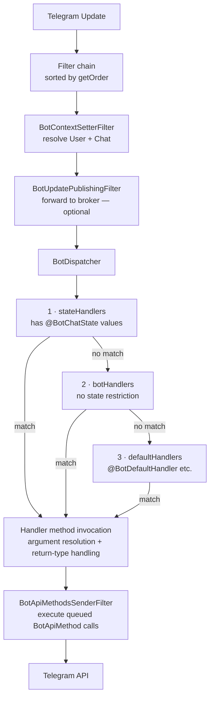

# core

> The processing engine of the Easygram framework.
> Provides annotation-driven routing, the filter pipeline, argument resolution, and return-type handling.

## Maven Dependency

```xml
<dependency>
    <groupId>uz.osoncode.easygram</groupId>
    <artifactId>core</artifactId>
    <version>0.0.5</version>
</dependency>
```

> **Note:** The `starter` dependency includes `core` transitively. You only need this explicit dependency if you are building a custom transport or extension module.

## What It Does

The core module contains the framework engine:
- Scans `@BotController` beans and routes updates to matching handler methods
- Executes the `BotFilter` pipeline on every incoming update
- Resolves method parameters via `BotArgumentResolver` implementations
- Handles method return values via `BotReturnTypeHandler` implementations
- Dispatches exception handling to `@BotExceptionHandler` methods

### Processing pipeline



### Handler dispatch tiers

The dispatcher routes each update through **three ordered tiers**, stopping at the first
successful match:

| Tier | Handlers included | Searched first? |
|------|-------------------|-----------------|
| **stateHandlers** | All methods with at least one value in `@BotChatState` | ✅ Yes |
| **botHandlers** | All spec-type handlers with no state restriction | 2nd |
| **defaultHandlers** | All fallback handlers (`@BotDefaultHandler`, etc.) with no state restriction | Last |

This guarantees that state-specific handlers always take precedence over generic fallbacks
without requiring any manual ordering.

## @BotController

All handler methods must reside in a class annotated with `@BotController`.

```java
@BotController
public class MyBotHandler {
    // handler methods here
}
```

## Handler Annotations

All handler methods must reside in a class annotated with **`@BotController`** (a specialised `@Component`).

| Annotation | Description | Example |
|---|---|---|
| `@BotCommand` | Matches bot command messages | `@BotCommand("/start")` |
| `@BotDefaultCommand` | Fallback for unmatched commands | `@BotDefaultCommand` |
| `@BotText` | Matches exact plain-text messages | `@BotText("hello")` |
| `@BotTextDefault` | Fallback for unmatched text messages | `@BotTextDefault` |
| `@BotCallbackQuery` | Matches callback queries by `data` value | `@BotCallbackQuery("btn_ok")` |
| `@BotDefaultCallbackQuery` | Fallback for unmatched callback queries | `@BotDefaultCallbackQuery` |
| `@BotContact` | Matches contact-sharing messages | `@BotContact` |
| `@BotLocation` | Matches location-sharing messages | `@BotLocation` |
| `@BotDefaultHandler` | Global fallback for any unmatched update | `@BotDefaultHandler` |
| `@BotExceptionHandler` | Handles a specific exception type | `@BotExceptionHandler(Throwable.class)` |

## Parameter Injection

Mix and match parameters in any order — the framework resolves them automatically.
Every type can also be wrapped in `Optional<T>` (e.g. `Optional<User>`) — `Optional.empty()` is injected when no value is available.

| Parameter | Description |
|---|---|
| `@BotCommandValue String` | The matched command string (e.g. `"/start"`) |
| `@BotTextValue String` | The full message text |
| `@BotCallbackQueryData String` | The `data` field of a callback query |
| `@BotCommandQueryParam T` | Typed arg parsed from the command (e.g. `/start 42` → `42`) |
| `Update` | Raw Telegram `Update` object |
| `User` | Resolved sender |
| `Chat` | Resolved chat |
| `Contact` | Shared contact object |
| `Location` | Shared location object |
| `CallbackQuery` | Full `CallbackQuery` object |
| `TelegramClient` | Telegram API client for direct calls |
| `BotRequest` | Full request context (update + metadata) |
| `BotResponse` | Response accumulator — imperatively add `BotApiMethod` instances |
| `BotMetadata` | Metadata about the current bot (token, username, ID) |
| `BotChatStateService` | Chat state service — inject to read/write state inside any handler |
| `Throwable` (subtype) | *(Exception handlers only)* The thrown exception |
| `Optional<T>` | Any of the above wrapped in Optional; `Optional.empty()` when unavailable |

## Return Types

| Return Type | Behaviour |
|---|---|
| `void` | Nothing is sent; use side-effects or `BotResponse` |
| `BotApiMethod<?>` (e.g. `SendMessage`) | Executed via the Telegram client |
| `Collection<BotApiMethod<?>>` | Each element executed in order |
| `String` | Sent as a plain-text reply to the originating chat |
| `PlainTextTemplate` | Formatted plain text (non-i18n) |
| `LocalizedReply` | Template resolved via `BotMessageSource` then sent as text (requires `core-i18n`) |
| `Collection<Object>` / `List<Object>` | **Mixed collection** — each element dispatched to the matching handler by runtime type |

### Mixed collections

Return a heterogeneous `Collection<Object>` to send multiple different response types
from a single handler:

```java
@BotCommand("/demo")
public List<Object> onDemo(User user) {
    return List.of(
        "Hello " + user.getFirstName() + "!",         // → SendMessage (plain text)
        LocalizedReply.of("${welcome}"),               // → resolved i18n SendMessage
        SendMessage.builder()                          // → BotApiMethod sent directly
                .chatId(...)
                .text("raw api message")
                .build()
    );
}
```

Any element type that has a registered `BotReturnTypeHandler` with `supportsElement`
implemented is valid. Elements with no matching handler are silently skipped.

## Chat State with `@BotChatState`

Restrict a handler to run only when the chat is in a specific state. Combine with
`BotChatStateService` to drive multi-step conversation flows.

```java
@BotController
public class OrderFlow {

    @BotCommand("/order")
    public String start(User user, BotChatStateService states) {
        states.setState(user.getId(), "AWAITING_PRODUCT");
        return "Which product?";
    }

    @BotTextDefault
    @BotChatState("AWAITING_PRODUCT")
    public String collectProduct(@BotTextValue String product, User user,
                                 BotChatStateService states) {
        states.setState(user.getId(), "AWAITING_QTY");
        return "How many \"" + product + "\"?";
    }

    @BotTextDefault
    @BotChatState("AWAITING_QTY")
    public String collectQty(@BotTextValue String qty, User user,
                              BotChatStateService states) {
        states.clearState(user.getId());
        return "Order placed: " + qty + " unit(s). ✅";
    }
}
```

Apply `@BotChatState` at the **class level** to set a default for all methods. Override
on individual methods with a different (or empty) array. See
[core-chatstate/README.md](../core-chatstate/README.md) for the full guide.

## Annotation-driven State Transitions

Instead of injecting `BotChatStateService` just to call `setState`, apply
`@BotForwardChatState` or `@BotClearChatState` **on the handler method itself**.
The framework sets the state automatically **after** the handler returns successfully.

### `@BotForwardChatState`

Moves the chat to a new state after the handler completes:

```java
@BotCommand("/start")
@BotForwardChatState("AWAITING_NAME")
public String startRegistration() {
    return "Step 1/3 — What is your full name?";
}
```

No `BotChatStateService` injection needed.

### `@BotClearChatState`

Clears the chat state (sets it to `null`) after the handler completes:

```java
@BotTextDefault
@BotChatState("AWAITING_CITY")
@BotClearChatState
public String collectCity(@BotTextValue String city) {
    return "🎉 Registration complete! City: " + city;
}
```

### Combined example (compare with manual approach)

```java
// ── Before (manual) ──────────────────────────────────
@BotCommand("/register")
@BotChatState
public String start(User user, BotChatStateService states) {
    states.setState(user.getId(), "AWAITING_NAME");
    return "What is your name?";
}

@BotTextDefault
@BotChatState("AWAITING_CITY")
public String collectCity(@BotTextValue String city, User user,
                          BotChatStateService states) {
    states.clearState(user.getId());
    return "Done! City: " + city;
}

// ── After (annotation-driven) ────────────────────────
@BotCommand("/register")
@BotChatState
@BotForwardChatState("AWAITING_NAME")
public String start() {
    return "What is your name?";
}

@BotTextDefault
@BotChatState("AWAITING_CITY")
@BotClearChatState
public String collectCity(@BotTextValue String city) {
    return "Done! City: " + city;
}
```

> **When NOT to use annotations:** if the state transition is conditional (e.g. state
> advances only when the input is valid), keep calling `BotChatStateService` directly.
> Annotations always apply unconditionally after a successful return.

See [core-chatstate/README.md](../core-chatstate/README.md) for the full chat-state guide.

## Handler Ordering with `@BotOrder`

When multiple methods match the same update, `@BotOrder` controls execution. **Lower = higher priority.** Default is `Integer.MAX_VALUE`.

```java
@BotController
public class PriorityExample {

    @BotCommand("/start")
    @BotOrder(1)                    // runs first
    public SendMessage vipHandler(User user) { ... }

    @BotCommand("/start")
    @BotOrder(10)                   // runs second
    public void auditHandler(@BotCommandValue String cmd) { ... }
}
```

## Exception Handling with `@BotExceptionHandler`

Declare `@BotExceptionHandler` inside any `@BotController` to handle a specific exception type:

```java
@BotExceptionHandler(Throwable.class)
public List<SendMessage> onError(Update update, Throwable ex) {
    if (update.getMessage() == null) return List.of();
    return List.of(SendMessage.builder()
            .chatId(update.getMessage().getChatId())
            .text("⚠️ Error: " + ex.getMessage())
            .build());
}
```

## Custom Filters

`BotFilter` intercepts every update **before** it reaches handlers. Filters run in ascending `getOrder()` order.

### Built-in filter execution order

The following built-in filters are registered automatically (lower order = runs first):

| Order constant | Value | Filter | Module | Description |
|---|---|---|---|---|
| `BotFilterOrder.MDC_CONTEXT` | `Integer.MIN_VALUE` | `BotMdcFilter` | `core` | Sets MDC keys `bot.update.id` and `bot.transport`; cleared in `finally` after the chain. |
| `BotFilterOrder.CONTEXT_SETTER` | `Integer.MIN_VALUE + 1` | `BotContextSetterFilter` | `core` | Resolves `Chat` and `User` from the update; enriches MDC with `bot.chat.id` / `bot.user.id`. |
| `BotFilterOrder.OBSERVATION` | `Integer.MIN_VALUE + 2` | `BotObservabilityFilter` | `core-observability` | Wraps the remaining pipeline in a Micrometer `Observation` (timer metric + trace span). |
| `BotFilterOrder.API_SENDER` | `Integer.MIN_VALUE + 3` | `BotApiMethodsSenderFilter` | `core` | Calls downstream, then sends all accumulated `BotApiMethod` responses via `TelegramClient`. |
| `BotFilterOrder.PUBLISHING` | `Integer.MIN_VALUE + 1000` | `BotUpdatePublishingFilter` | `messaging-api` | Forwards the raw update to a broker (Kafka / RabbitMQ). Only active when a broker is configured. |

**Safe order ranges for custom filters:**

| Where to run | Recommended range |
|---|---|
| Before all built-in logic (e.g. auth, rate-limiting) | `Integer.MIN_VALUE + 10` to `Integer.MIN_VALUE + 99` |
| After context is set, before dispatch (e.g. metrics, A/B) | `Integer.MIN_VALUE + 100` to `Integer.MIN_VALUE + 499` |
| After all built-in filters | `0` and above |

```java
@Component
public class AuthFilter implements BotFilter {

    @Override
    public int getOrder() { return 1; }

    @Override
    public boolean shouldFilter(BotRequest request, BotResponse response) {
        return request.getUpdate().hasMessage();
    }

    @Override
    public void doFilter(BotRequest request, BotResponse response, BotFilterChain chain) {
        Long userId = request.getUpdate().getMessage().getFrom().getId();
        if (!isAllowed(userId)) {
            response.addMethod(SendMessage.builder()
                    .chatId(userId).text("⛔ Access denied.").build());
            return; // short-circuit — handler never invoked
        }
        chain.doFilter(request, response);
    }

    private boolean isAllowed(Long userId) { return true; }
}
```

Declare as `@Component` or `@Bean` — the framework picks it up automatically.

## Overriding Default Beans

Every framework bean is guarded by `@ConditionalOnMissingBean`. Declare a bean of the same type
to replace any default without forking the library.

### Provider model

Infrastructure concerns are each exposed as a fine-grained `@FunctionalInterface` provider.
Override only what you need — everything else uses its default.

#### Common providers (all transports)

| Provider | Default | Typical override |
|---|---|---|
| `BotOkHttpClientProvider` | `new OkHttpClient()` | Custom timeouts, proxy, interceptors |
| `BotExecutorServiceProvider` | `newFixedThreadPool(max(2, availableProcessors()))` | Custom pool size, virtual threads |
| `BotTelegramUrlProvider` | `TelegramUrl.DEFAULT_URL` | Local Telegram mock in tests |
| `BotObjectMapperProvider` | shared Spring `ObjectMapper` | JavaTime module, custom serialisers |
| `BotTelegramClientProvider` | `OkHttpTelegramClient` | Custom `TelegramClient` wrapper |

#### Long-polling-specific providers

| Provider | Default | Typical override |
|---|---|---|
| `BotScheduledExecutorServiceProvider` | `newSingleThreadScheduledExecutor()` | Named threads, custom pool size |
| `BotBackOffProvider` | `new ExponentialBackOff()` | Fixed interval, max elapsed time |
| `BotGetUpdatesGeneratorProvider` | limit=100, timeout=50 | Lower limit, allowed updates filter |

### Example: tune HTTP timeouts

```java
@Bean
public BotOkHttpClientProvider botOkHttpClientProvider() {
    OkHttpClient client = new OkHttpClient.Builder()
            .connectTimeout(30, TimeUnit.SECONDS)
            .readTimeout(60, TimeUnit.SECONDS)
            .build();
    return () -> client;
}
```

### Example: custom `GetUpdates` parameters

```java
@Bean
public BotGetUpdatesGeneratorProvider botGetUpdatesGeneratorProvider() {
    return () -> offset -> GetUpdates.builder()
            .offset(offset + 1)
            .limit(10)
            .timeout(100)
            .allowedUpdates(List.of("message", "callback_query"))
            .build();
}
```

### Custom Jackson ObjectMapper

```java
@Bean
public BotObjectMapperProvider botObjectMapperProvider() {
    ObjectMapper om = new ObjectMapper()
            .registerModule(new JavaTimeModule())
            .disable(SerializationFeature.WRITE_DATES_AS_TIMESTAMPS);
    return () -> om;
}
```

### Custom startup hook

```java
@Component
public class MyStartTrigger implements BotStartTrigger {

    @Override
    public void execute(User bot, TelegramClient telegramClient) {
        log.info("Bot @{} started", bot.getUserName());
    }
}
```

## Transport × Messaging Matrix

The table below describes all valid transport + messaging combinations so you can
pick the right setup without trial and error.

| `easygram.update.transport` | `messaging.producer.type` | `messaging.forward-only` | Behaviour |
|-----------------------------|---------------------------|--------------------------|-----------|
| `LONG_POLLING` *(default)*  | *(none)*                  | —                        | Classic standalone bot. Updates polled and dispatched to `@BotController` handlers only. |
| `LONG_POLLING`              | `KAFKA` or `RABBIT`       | `false` *(default)*      | Polls updates, dispatches to local handlers **and** publishes to broker. Useful for analytics, auditing. |
| `LONG_POLLING`              | `KAFKA` or `RABBIT`       | `true`                   | Polls updates and **only** publishes to broker. All `@BotController` handlers are skipped. Use for relay/proxy bots. |
| `WEBHOOK`                   | *(none)*                  | —                        | Classic standalone bot. Telegram pushes updates via HTTP POST. |
| `WEBHOOK`                   | `KAFKA` or `RABBIT`       | `false`                  | Receives via webhook, dispatches locally **and** publishes to broker. |
| `WEBHOOK`                   | `KAFKA` or `RABBIT`       | `true`                   | Receives via webhook, **only** publishes to broker. Local handlers skipped. |
| `KAFKA_CONSUMER`            | *(none)*                  | —                        | Consumes updates from Kafka, dispatches to `@BotController` handlers. No Telegram polling. |
| `RABBIT_CONSUMER`           | *(none)*                  | —                        | Consumes updates from RabbitMQ, dispatches to `@BotController` handlers. No Telegram polling. |
| `NONE`                      | *(none)*                  | —                        | No transport active. Provide your own update ingestion via a custom `BotHandler` bean or test harness. |

> **Startup warnings**: The framework emits `WARN` logs for the most common misconfigurations:
> - `messaging-api` on classpath but `producer.type` not set → updates won't reach broker
> - `forward-only=true` with `LONG_POLLING`/`WEBHOOK` → local handlers will be skipped
> - `transport=NONE` with no `Bot` beans registered → no updates will ever arrive

## See Also

- [core-api/README.md](../core-api/README.md) — full annotation & interface reference
- [longpolling/README.md](../longpolling/README.md) — long-polling transport
- [webhook/README.md](../webhook/README.md) — webhook transport
- [core-chatstate/README.md](../core-chatstate/README.md) — chat state management (`@BotChatState`)
- [core-i18n/README.md](../core-i18n/README.md) — internationalisation
