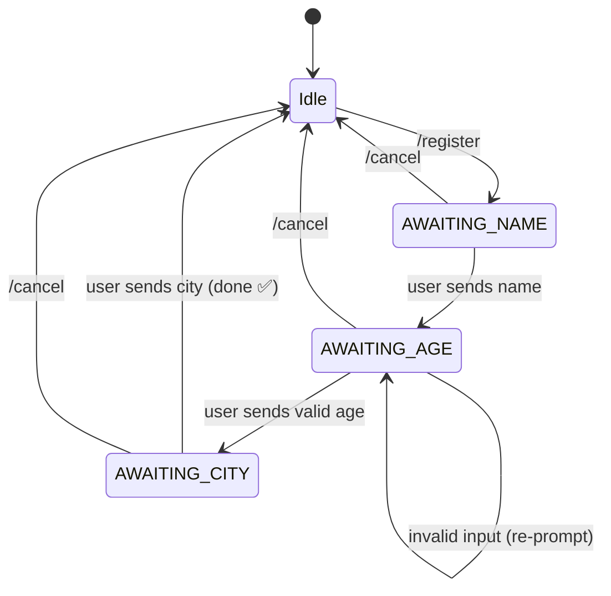
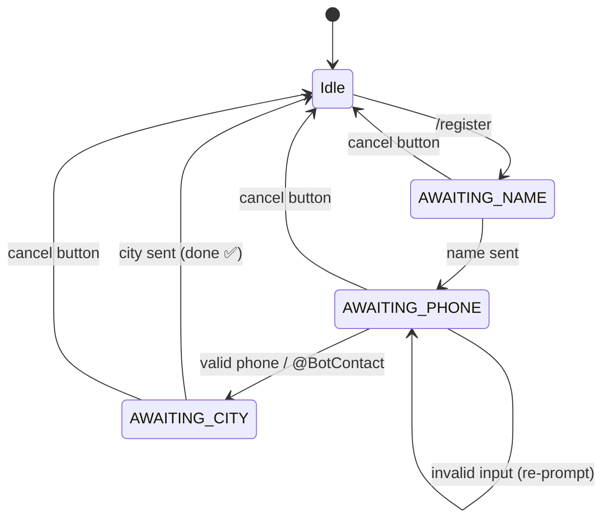
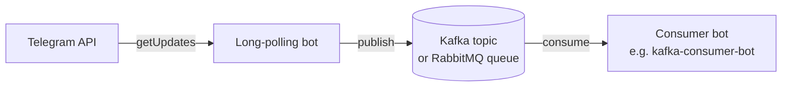
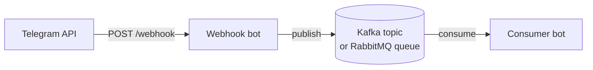
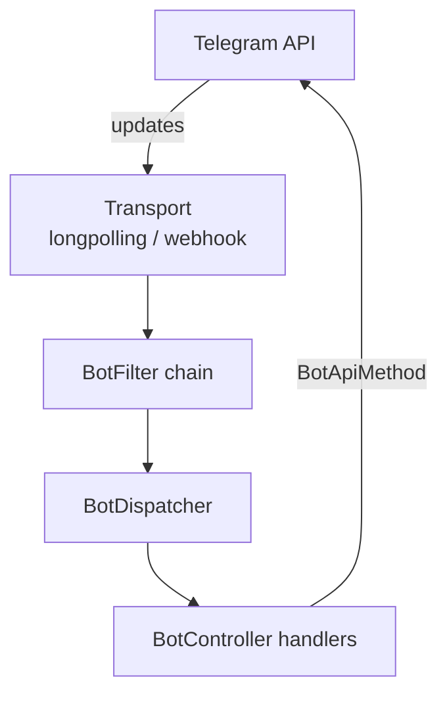
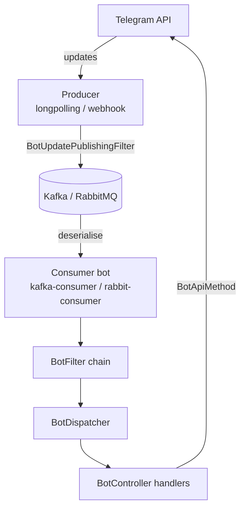

# samples

Runnable Spring Boot applications demonstrating every transport, chat-state-driven
multi-step flows, and broker-forwarding (producer) patterns.

---

## Table of Contents

- [Sample Overview](#sample-overview)
- [Build & Run](#build--run)
- [Samples](#samples)
  - [longpolling-bot](#longpolling-bot)
  - [webhook-bot](#webhook-bot)
  - [chatstate-bot](#chatstate-bot)
  - [i18n-registration-bot](#i18n-registration-bot)
  - [longpolling-as-producer](#longpolling-as-producer)
  - [webhook-as-producer](#webhook-as-producer)
  - [kafka-consumer-bot](#kafka-consumer-bot)
  - [rabbit-consumer-bot](#rabbit-consumer-bot)
- [Architecture Patterns](#architecture-patterns)

---

## Sample Overview

| Sample | Transport | Broker | Chat State | Description |
|---|---|---|---|---|
| `longpolling-bot` | Long-polling | — | — | Minimal echo bot |
| `webhook-bot` | Webhook | — | — | Echo bot over HTTPS webhook |
| `chatstate-bot` | Long-polling | — | ✅ | Multi-step registration wizard |
| `i18n-registration-bot` | Long-polling | — | ✅ | i18n wizard: `LocalizedReply`, `LocalizedTemplate`, `@BotTextPattern`, `@BotReplyButton`, observability |
| `longpolling-as-producer` | Long-polling | Kafka / RabbitMQ | — | Forwards updates to a broker |
| `webhook-as-producer` | Webhook | Kafka / RabbitMQ | — | Forwards updates to a broker |
| `kafka-consumer-bot` | Kafka consumer | Kafka | — | Processes updates from a Kafka topic |
| `rabbit-consumer-bot` | RabbitMQ consumer | RabbitMQ | — | Processes updates from a RabbitMQ queue |

---

## Build & Run

From the repository root, build all sample apps (skipping tests):

```bash
cd samples
mvn package -DskipTests
```

Run a specific sample:

```bash
cd samples/longpolling-bot
mvn spring-boot:run
```

Before running, replace `BOT_TOKEN` in `src/main/resources/application.yml` with your actual
token from [@BotFather](https://t.me/BotFather).

---

## Samples

### longpolling-bot

**Module:** `samples/longpolling-bot`

The simplest possible bot. Uses the default long-polling transport; no extra infrastructure needed.

**Key classes:**
- `LongpollingBotApplication` — Spring Boot entry point with a custom `LongPollingConfigurer` showing timeout tuning
- `EchoBotController` — handles `/start`, `/help`, plain text, and an unknown-update fallback

**Configuration snippet:**
```yaml
easygram:
  token: "BOT_TOKEN"
  # transport: LONG_POLLING  # default — no need to set
```

**Dependencies:** `longpolling`

---

### webhook-bot

**Module:** `samples/webhook-bot`

Echo bot using the webhook transport. Requires a public HTTPS URL (e.g. from [jprq](https://jprq.site), [ngrok](https://ngrok.com), or a real domain) so Telegram can POST updates.

**Key classes:**
- `WebhookBotApplication` — registers a `BotTelegramUrlProvider` bean that points to a custom `TelegramUrl`
- `EchoBotController` — same handlers as the long-polling sample

**Configuration snippet:**
```yaml
easygram:
  token: "BOT_TOKEN"
  transport: WEBHOOK
  webhook:
    url: "https://bot.example.com/webhook"
    path: /webhook
    drop-pending-updates: false
    unregister-on-shutdown: false

server:
  port: 8080
```

**Dependencies:** `webhook`

---

### chatstate-bot

**Module:** `samples/chatstate-bot`

Demonstrates multi-step conversation flows using `@BotChatState` and `BotChatStateService`.
A three-step registration wizard collects a user's **name → age → city**, with `/cancel`
available at any step.

**Registration flow:**



**Key classes:**

| Class | Purpose |
|---|---|
| `ChatStateBotApplication` | Spring Boot entry point |
| `RegistrationState` | Enum defining wizard stages (`AWAITING_NAME`, `AWAITING_AGE`, `AWAITING_CITY`) |
| `RegistrationFlowController` | `@BotChatState`-guarded handlers for each wizard step |
| `GlobalCommandController` | `/start`, `/status`, `/cancel`, and default handler |

**What this sample teaches:**

1. **Class-level `@BotChatState`** — restricts all methods in `RegistrationFlowController` to
   run only during registration states.
2. **Method-level override** — `/register` uses bare `@BotChatState` (empty array) to accept
   any state, overriding the class restriction and allowing restart.
3. **Enum-based states** — `chatStateService.setState(userId, RegistrationState.AWAITING_NAME)`
   and `chatStateService.getStateAs(userId, RegistrationState.class)` for type-safe state access.
4. **State clearing** — `chatStateService.setState(userId, (String) null)` removes the state
   and ends the wizard.
5. **Multiple controllers** — the two controllers cooperate seamlessly; the framework routes
   to the correct handler based on current state.

**Configuration snippet:**
```yaml
easygram:
  token: "BOT_TOKEN"
  # InMemoryBotChatStateService is registered automatically — no extra config needed.
```

**Dependencies:** `longpolling` (includes `core-chatstate` transitively)

**Interaction example:**
```
User:  /register
Bot:   📝 Let's get you registered! Step 1/3 — What is your full name?

User:  Alice Smith
Bot:   ✅ Name saved: Alice Smith. Step 2/3 — How old are you?

User:  abc
Bot:   ⚠️ That doesn't look like a number. Please enter your age as digits only.

User:  30
Bot:   ✅ Age saved: 30. Step 3/3 — Which city do you live in?

User:  /status
Bot:   📝 Wizard in progress — waiting for your city (step 3/3).

User:  Tashkent
Bot:   🎉 Registration complete! City: Tashkent ...

User:  /status
Bot:   ℹ️ You have no active registration wizard.
```

---

### i18n-registration-bot

**Module:** `samples/i18n-registration-bot`

Internationalised multi-step registration wizard. Builds on the chat-state concepts from
`chatstate-bot` and layers in every i18n feature: `LocalizedReply`, `LocalizedTemplate`,
`@BotReplyButton` with message-key matching, `@BotTextPattern` for declarative input
validation routing, and Spring Boot Actuator / Micrometer observability.

**Registration flow:**



**Key classes:**

| Class | Purpose |
|---|---|
| `I18nRegistrationBotApplication` | Spring Boot entry point |
| `RegistrationState` | Enum: `AWAITING_NAME`, `AWAITING_PHONE`, `AWAITING_CITY` |
| `RegistrationController` | Wizard steps; uses `LocalizedReply` / `LocalizedTemplate` and `@BotTextPattern` for phone routing |
| `GlobalController` | `/start`, `/status`, `/cancel`; demonstrates `LocalizedTemplate` with positional args and `Locale` injection |
| `RegistrationMarkups` | `@BotMarkup`-annotated keyboards (cancel button, phone request) |

**i18n patterns demonstrated:**

1. **`LocalizedReply`** — every step prompt is a single translated message key
2. **`LocalizedTemplate`** — registration summary mixes `${key}` lookups and `#{n}` positional args
3. **`@BotReplyButton("btn.cancel")`** — one annotation matches "❌ Cancel", "❌ Bekor qilish", and "❌ Отмена" automatically
4. **`@BotTextPattern`** — routes valid phone numbers (`^\+\d{7,15}$`) to one handler and invalid input to another, eliminating if/else validation
5. **`Locale` injection** — injected directly as a method parameter via `BotLocaleArgumentResolver`
6. **`@BotContact`** — accepts a Telegram contact share as an alternative to typing a number
7. **Bean Validation** — `@NotBlank` / `@Size` on handler parameters; caught by a local `@BotExceptionHandler(ConstraintViolationException.class)` that returns localised error messages

**Observability included** — the sample ships with a `docker-compose.yml` running Prometheus + Grafana. The pre-built Grafana dashboard visualises `easygram.update` latency histograms and error rates.

**Configuration snippet:**

```yaml
easygram:
  token: "BOT_TOKEN"

spring:
  messages:
    basename: messages/bot
    encoding: UTF-8

management:
  endpoints:
    web:
      exposure:
        include: health,info,prometheus,metrics
```

**Dependencies:** `spring-boot-starter` (includes `core-i18n`, `core-chatstate`, `core-observability` transitively)

**Supported locales:** English (`en`), Uzbek (`uz`), Russian (`ru`)

---

### longpolling-as-producer

**Module:** `samples/longpolling-as-producer`

Long-polling bot that **forwards every update to a broker** instead of (or in addition to)
processing it locally. Demonstrates the `messaging-producer` + `forward-only` pattern:



Set `easygram.messaging.forward-only: true` to skip local handlers entirely.
Set it to `false` to both publish and handle locally.

**Switch broker** by changing `easygram.messaging.producer.producer-type`:
```yaml
easygram:
  messaging:
    forward-only: true
    producer:
      producer-type: rabbit   # or: kafka
```

**Dependencies:** `longpolling`, `messaging-producer`

---

### webhook-as-producer

**Module:** `samples/webhook-as-producer`

Same forward-only pattern as `longpolling-as-producer`, but using the webhook transport.



**Dependencies:** `webhook`, `messaging-producer`

---

### kafka-consumer-bot

**Module:** `samples/kafka-consumer-bot`

Processes Telegram updates consumed from a **Kafka topic**. Intended to run alongside a
producer sample (`longpolling-as-producer` or `webhook-as-producer`).

```mermaid
flowchart LR
    P[Producer bot] -->|publish JSON| T[(Kafka topic)]
    T -->|@KafkaListener| C[kafka-consumer-bot]
    C -->|sendMessage| TG[Telegram API]
```

**Configuration snippet:**
```yaml
easygram:
  token: "BOT_TOKEN"
  transport: KAFKA_CONSUMER
  kafka-consumer:
    topic: easygram-updates
    create-if-absent: true

spring:
  kafka:
    bootstrap-servers: localhost:9092
    consumer:
      group-id: my-telegram-bot
```

**Dependencies:** `kafka-consumer`, `spring-kafka`

---

### rabbit-consumer-bot

**Module:** `samples/rabbit-consumer-bot`

Processes Telegram updates consumed from a **RabbitMQ queue**. Intended to run alongside a
producer sample.

```mermaid
flowchart LR
    P[Producer bot] -->|publish JSON| E[(RabbitMQ exchange)]
    E -->|routing key| Q[(Queue)]
    Q -->|@RabbitListener| C[rabbit-consumer-bot]
    C -->|sendMessage| TG[Telegram API]
```

**Configuration snippet:**
```yaml
easygram:
  token: "BOT_TOKEN"
  transport: RABBIT_CONSUMER
  rabbit-consumer:
    queue: easygram-updates
    exchange: easygram-exchange
    routing-key: easygram.updates
    create-if-absent: true

spring:
  rabbitmq:
    host: localhost
    port: 5672
    username: guest
    password: guest
```

**Dependencies:** `rabbit-consumer`, `spring-boot-starter-amqp`

---

## Architecture Patterns

### Pattern 1 — Standalone bot (long-polling or webhook)



### Pattern 2 — Fan-out: ingest → broker → processor



### Pattern 3 — Chat-state-driven conversation

```mermaid
flowchart TD
    U[User message] --> F[BotFilter chain]
    F --> D[BotDispatcher]
    D -->|check @BotChatState| S{Current state?}
    S -->|AWAITING_NAME| H1[collectName handler]
    S -->|AWAITING_AGE| H2[collectAge handler]
    S -->|AWAITING_CITY| H3[collectCity handler]
    S -->|null / any| H4[Global handler]
    H1 & H2 & H3 --> CS[(BotChatStateService\nIn-memory / Redis / JDBC)]

